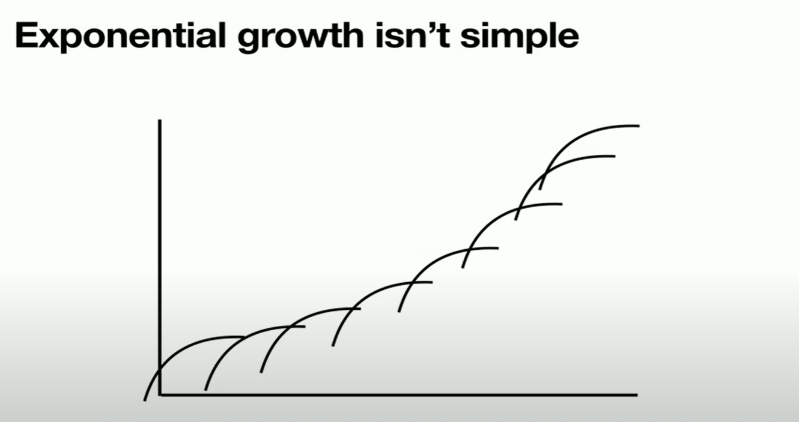

## 摩尔定律

我最喜欢的东西之一，比如E=MC^2似乎很可靠，对吗？ E没有确切的定义，M没有定义，光速是两个数字的比率，有任意的单位。就像我们把这些东西视为理所当然。

这真的有点令人惊讶，我们也生活在这个有趣的世界，指数增长建立在收益递减的基础上。

这也是我在英特尔工作时，我们正在研究的一个问题，英特尔是摩尔定律的公司，世界上所有的人，包括在英特尔工作的人都说摩尔定律已经死了。所以我做了一点数学题，摩尔定律已经死了，或者摩尔定律的公司也死了，所以我就开始证明 摩尔定律没有死，我在伯克利做了一个演讲，就在大卫-帕特森面前，他是一个伟大的人，超级聪明。

几乎所有的技术都有一个递减的回报曲线，无论你做什么，你开始工作 一开始进展很快，后来就慢下来了。而且进展并不是因为你想出了解决方法，而是因为你在不同的曲线上得到了进展。现在已经没有拨号盘式电话工程师了，拨号盘被按钮取代了，被智能手机取代了，被iPhone取代了，现在全世界都在说，你怎么能让iPhone更好呢？我不知道，我认为这是其中的一个维度，我认为它做得很好，从现在起十年内没有人会谈论iPhone，我的预测是对的。史蒂夫-乔布斯是我最初向苹果公司的所有人指出这一点的人，他说你必须知道的是你在任务回报曲线上，你必须进入下一个曲线，对吗？从营销的角度来看，可怕的是，当你进入下一条曲线时，你可能会变得更糟，你注意到这些曲线的所有重叠点，你必须从一个良好的高原跳到更糟糕的时候。这是所有科学和工程的问题，它是可怕的，但如果你不这样做，别人会杀了你。我想把这个话题重新规划一下，因为我们已经达到了事物的极限，这就是实验性的东西。

我一直在和一些朋友聊天，我有个朋友叫Kylon Gibbs，他开了一家人工智能公司，我们在讨论人工智能和信息有什么不同，计算机对它们所做的事情一无所知，大数据是1和0。大数据系统中的智能行为者不是计算机，而是人类。

 所以我们生活在一个有趣的世界里，在底部有量子现实量子场不确定性原理原子，它们真的很有趣。它们非常有趣 现在我们生活在一个物理现实中，它主要是由电磁力和化学引力介导的，对于计算机设计来说，我们大多忽略了引力。但电磁场是一种大型的宏观事物，对，这些事物在世界范围内有一定的位置，并做一些事情，这就是信息现实，比方说你知道所有东西在哪里，你知道它们有多大，对，然后还有关于这些东西的知识，迄今为止只有人类有关于任何知识，对，这是一个非常有趣的事情。

另一种方式是晶体管将量子现实与物理现实连接起来，就在下面 在底部，原子有壳，它们有额外的电子，它们捐献电子，它们导致电场，如果你把电子放在一个非常小的地方，为你提供隧道，所有这些量子效应都在这里，但当你使用一个晶体管时，你有一个立方体的硅图案，它从一个地方移动一个电场。它把电场从1伏移到0伏，这很有趣，我们用1亿个原子来转换1伏到0伏的电压，这就是宏观效应，然后计算机给我们提供信息的现实。

晶体管，从字面上看是一种非常不同的计算机，这是一张鳍片的图片，我把它放在一个叫sketchfab. 如果有人想看晶体管的话，这个3D模型是非常有趣的，不过这些大理石状的东西是伸出来的鳍片，蓝色的是氧化硅，绿色的是另一个绝缘体，红色和紫色的小东西是源极和漏极的外延生长，在鳍片中间的几个地方的弧形东西是栅极。晶体管实际上主要是绝缘体，事实证明，然后上面的东西是金属堆，没有绝缘体。

当他们从6微米开始的时候，每年把它变小是非常容易的，对吧，然后到了一定程度，那个波长干扰了它，所以他们开始做激光，对吧，它到了193，然后再超过193就很难了，所以他们做了沉浸式激光，基本上是把激光射入水中，然后他们做了多 然后他们做了多模式和其他的东西，但是能量用完了，然后他们就去造了EUV。

现在EUV是地球上最疯狂的东西，你花了一亿美金买了一个激光束，他们用激光射向金属点，以获得可能混淆的紫外线。我最近和一些人谈过，他们正在使用一个100米长的电子粒子加速器向一个非常强的磁铁周围发射电子，以获得回旋辐射。然后用这些反射率为百分之一的镜子进行铺设和分配，所以它就像一个兆瓦的输入和一个毫瓦的输出，以形成一个一纳米的东西。

激光的大小和能量的比例导致了你实际要做的事情基本上是我见过的最疯狂的事情。 但是他们可能会去建造它，这就带来了问题的根本所在。

所以这是一个非常简单的曲线，等于H Lambda ：随着波长变短，能量上升，如果你想制造晶体管，你会希望这条曲线正好与此相反。 你会希望它像一条从原点出来的45度线 所以当你把它变小时，能量就会下降，而不是上升。所以这变成了一个基本问题： 当你开始接触到这些细微的东西时， 每个光子的能量就会变得很高。 这就扰乱了他们试图设计的东西。 所以这听起来是一个真正的问题， 对吗？ 

这里有人听说过DNA折纸吗？  它已经存在了10年。 我们和一些人谈过这个问题， 大多数人都是生物学家，他们从来没有想过计算机模式，所以这里有一个非常狂野的东西，世界上计算效率最高、功率最低的计算机是你的大脑。它大约这么大，每个人都有一个，你的大脑中的每一个细胞都有一个脑工厂，它能够复制整个大脑。 所以制造大脑的工厂比大脑还小，而且它在室温下以非常低的能量做所有的事情、没有火，它做了两件惊人的事情：它做了原子组装，它在原子水平上做了信息组装。所以这很惊人，所以我的信念是： 摩尔定律并没有死，这里的每一个人都是一个活生生的例子。但从光刻技术的旋转电话到这个的桥梁真的很大，我希望一些研究人员正在研究这个，所以事实证明摩尔定律并没有死，嗯，它肯定是越来越贵了。

## 并行化

所以我想谈一下计算机，因为这有点疯狂，我们一直在制造计算机，我们通过制造更快的计算机使程序更快。我们写的程序在大多数情况下，如果你写的是C语言或汇编语言，或者每个人都在用Java编程，有一个C语言程序员，对，就像你的声明性代码，你说你知道A等于B加E，你运行它，然后计算机实际上让它更快。软件的硬件合同是非常可靠的，软件希望硬件能从内存中加载数据，进行操作，并将数据按顺序存储到内存中。所以数字设备公司违反了Alpha的硬件软件合同，我们的内存排序很弱，这意味着数据没有按顺序回到内存，数字公司破产了，因为他们违反了合同 我最近才意识到这一点。

使计算机更快的事情，如列表上展示的，不胜枚举。但我最喜欢的是晶体管数量，给我们足够的晶体管，以开始流水线。 我们花了很多时间在频率上，然后我们有了一个频率限制。因为你真的不能让价格阶段超过每时钟20或25门，因为它变得太复杂了。人类无法处理。然后我们去了并行主义 然后我们就转向了乱序执行，我曾在EV6和数字方面工作过，很多人向我们承诺，我们永远不可能做到这一点，这几乎是真的，我们没有验证的基础设施。现在我们增加了矢量单元，多处理器，数据预取，最后两个数据预取，分支预测真的很疯狂，因为这些使用 首先是电路技术和架构技术，所以我最近看到Zen处理器，里面有一些感知器，所以当我加入AMD的时候，分支预测器不是很好，他们都认为我们会变得更好，直到分支预测器更好。

下一个话题是并行程序，这是最令人困惑的事情之一，所以有人写过矩阵乘法吗？但很多人认为矩阵乘法是一个叫做mm或什么的程序，但左边的图片真的很简单，你把一行乘以一列，然后把它放在一个地方，这多简单啊，有多难啊。你遇到了麻烦，因为如果你有一个硬件抽象层，在那个层面上是没有意义的，你需要知识来解决这个问题，对吗？事实证明，没有人运行这些代码，他们屏蔽了代码，Swizzle代码和枢轴之一的《黑客帝国》，几年前有一个非常棒的演讲，有人说我要写一个天真的 矩阵乘法算法在Nvidia的GPU上，它的峰值约为3%，然后他们做了HPC的调整，他们把矩阵中的一个转轴，他们封锁了矩阵，他们看到了数据，他们得到了20，然后他们使用本地内存，得到了25%，他们得到了25到80的Nvidia公布的结果。我必须知道机器中的所有引擎是如何工作的，这很奇怪。

所以这是一个关于温度的维基百科页面，所以每过一段时间，你认为你知道事情是如何工作的，这里有人知道温度是如何工作的，你知道这是温度计上的一个东西，我正在和一个朋友谈论像原子的温度和一些东西，我想我只是查一下 温度，因为我在想它就像分子的动能或其他什么东西，它只是不断地继续下去，你知道不要让我开始讨论热容量，就像你在量子动力学中得到了真正的量子力学，真的很快，这是令人难以置信的复杂，对不对。

我有一本我有一本Credit One的手册，我每隔几年就看一次，我妻子看到我坐在椅子上，眼泪从脸上流下来，踱步看这本手册，你在做什么，你又在看那本手册，就像1970年一样，就像10纳秒一样，令人难以置信。我们建立模块处理器，我们建立MPI，这是一个松散的C框架。谷歌发明了map reduce，这显然是一件好事。然后Cuda公司的人做了一些事情，这很了不起，这是我见过的为数不多的并行编程模型之一。呃，但他们只是疯狂，所以我几年前在读Shader编译器的规格，因为在CPU中，当我们做一个矢量单元时，我们说好，我们有这个64位的寄存器，我们可以把两个32-位的东西放在那里。 位的东西，或者416位的东西，或者我们可以把寄存器做成线状，我们把256乘以8个32位的浮点数放在那里。 现在你的数组数据可能是1552，跨度可能是3，就像数据和程序一样，程序员根本不关心你的向量单元有一个固定的宽度。然后你的程序员会花一半的时间试图把程序员想做的事情映射到这个问题上。 

他们写的代码是一个标量程序的向量，因为他们的出发点完全不同。有一个2000乘1000像素的屏幕，他们在一个像素上运行程序，每隔一段时间，他们可以把一群像素组合起来，他们很乐意这样做，但这些像素并不相互影响。 所以他们写了一个像素程序的矢量，这就是Cuda，它是C语言上面的一个小盐，可以做到这一点，这是一个很好的模型，因为它总是可以运行得很慢。

但如果你是一个专家，你可以做到这一点。他们有几千个人让Matrix的乘法速度更快，但事实证明 然后因为越多越好，新的芯片有18000个78通道，你有295000个线程在一个芯片上运行，他们可以把256个芯片放到一个NV开关里。这使得整个GPU阵列看起来像一个大的GPU。这意味着你可以有一个7500万个线程的程序在运行，以保持繁忙。 

多线程编程几乎是完全疯狂的，所以摩尔定律将继续下去，单线程将继续下去，并行编程一直是奇怪的困难，就像我一直在断断续续地工作，有一些事情实际上做得很好，最终元素分析mapreduce是辉煌的，因为它的天才主要是如果你有像一百万个用户或你可以把一个数据库分成一百万块看，如果你可以得到一个宏观分割的东西，你可以去相当快。

前段时间，晶体管的数量使事情变得正确，所以当你添加很少的晶体管时，你会做出非常简单的专业计算机，如果有更多的晶体管，我们可以对它们进行流水线处理，我们可以不按顺序进行，我们发明了着色器多核处理器。

## 人工智能

我曾经认为人工智能要花很长时间，这将是不可能的，就像大脑的估计是每秒10到18次10到20次的计算，如果有人有任何数字，有一些人认为这可能是一个量子效应，但我不知道，但如果你只是映射出大脑和突触，20 18 20到8 10到18 10到20似乎是一个合理的数字，今天你可以买一个新的GPU或一个petaflop 10到15，你有一个大脑的计算量。所以在某种程度上，人工智能在过去几年开始活跃起来并不奇怪，谷歌的Jeff Dean说，当他们第一次开始研究一些人工智能模型时，他们做了一大堆工作来让模型运行，从一个CPU到64个CPU，因为他们认为更多的计算量会有帮助，他说我们只是错了10 000次。 就像从1个到64个一点帮助都没有。

所以世界上的事情就开始沸腾了，所以人工智能已经取代了传统的视觉算法。当我加入特斯拉的时候，有一大群人在做经典视觉，经典视觉是你分析一个图像，如果你想识别猫，你就找到点、圆的东西和模糊的东西，如果这些特征有某种关系，有某种统计分布，你就可以称之为猫，他们试图弄清楚车道线在哪里，汽车在哪里，经典的视觉根本不起作用。基本上你只能识别一半的汽车，然后AlexNet出现了，所以人工智能模型在识别物体和图像方面比人类更好。其中一个原因是人类擅长这个，其他的人擅长那个，一个模型可以把所有的结果加在一起做，我们的语言模型是令人难以置信的好。

GitHub将取代人工编程。我们正在开始使用试点，为我们的处理器在测试台上做测试生成，他们说现在它非常擅长做所有简单的明显的东西，但然后人们说好吧，人工智能永远不会做困难的事情。

有一个叫两分钟论文的栏目，意思是两分钟就会有另一篇论文，就像它发展得非常快一样。我和一个朋友讨论，我们能不能用一个人工智能模型，买世界上最好的工具来放置和布线，运行一堆实验，训练这个模型，然后取代CAD工具。答案可能是肯定的，就像有一大堆你认为有人类知识的编程东西，一旦这些东西被编程，它就是一个数据库。AM也非常擅长计算这个，所以我们用它来进行布局测试生成代码。

明年我们将尝试建立一个简单的风险斗争处理器，它比阿尔法处理器更快，我完全是从人工智能模型做的，然后完全通过开放源码运行。

所以人工智能程序员把他们所做的事情描述成图，我们有工具，所以我们把所有的人工智能程序都写在pytorch中，这基本上是疯狂的，因为它看起来一点都不像图。但我们确实产生了图，然后我们分析图，我们把图表映射到事情上，对吧，所以这是相当合理的做法。几乎所有人工智能论文在描述新模型的时候都是用图来描述的，但是对于硬件软件合同来说，他们实际做的是写pytorch。看起来一点都不像图，所以不要不要相信程序员对他们所做的描述，这绝不是真的，然后人工智能模型被训练，有人称之为猜测补漏，当有人第一次向我解释这个的时候，我就死了。所以你拿一个句子，你要做推理的句子，所以你用空白来运行它，让它预测空白，然后正确答案是你删除的那个词，对，然后你计算正确答案之间的误差函数，你想要的词和它产生的东西。不过当你刚开始训练它的时候，它是垃圾，对，然后人工智能的天才是许多层的矩阵乘法和一些有趣的sigmoid函数。

它的计算方式是A等于B乘以C再加上D，这都是相同的计算方式，对吗？ 你做了一万亿次，你就可以建立一个语言模型。同样的事情也适用于图像，你可以把一张图像删除一部分，然后猜出空白。你也可以对控制系统这样做，你可以取一个东西的路径，说它应该怎么走。然后这些人写了这篇叫Gatto的论文 他们把这三种东西都训练成同一个模型，对吗？因为你会认为图像、语言和序列是不同的东西，但它们不是，人工智能所做的是，它把只有人类能理解的1和0的数据，计算机不知道到底发生了什么，对吗？ 序列图像和语言都是1和0，对吗？它把它们嵌入一个空间，这是一个我不理解的数学结构，然后它对这些数据进行 它对这些数据进行矩阵乘法运算。然后训练权重，这样就有了数据，称为激活，它对数据进行局部删除。对，你慢慢修改权重，这样你就可以让它做你想做的事情。它实际上是在计算所有东西之间的关系，这是一个惊人的事情，计算机从来没有理解过任何数据，对，世界上没有计算机理解任何东西，因为它们只有比特。

人工智能似乎是将数据转化为它自己的计算空间，计算空间和数据是同一件事，对吗？ 想想你是如何思考的，你可以流畅地看一些东西，在你的头脑中识别和修改它们，移动它们，描述它们，你可以接受它，你可以接受任何东西，都在同一个空间，我们所谓的理解不是知识的总和，而是所有关系的总和。

这就是为什么我认为知识是信息之上的一层，它是变革性的。

我在自动驾驶方面工作了一段时间，同时我教我的两个女儿驾驶汽车。 所以在自动驾驶的世界里，我们正在建立这个大的神经网络。我们给它提供数以亿计的图像，然后很多时候你有一些东西，比如图像，也许还有来自路径的传感器数据，所以你给他们看一个图像，说路径应该是什么，然后事实证明你可以使用同样的猜测空白数据，所以你说这是过去的一个图像，预测控制系统的下一步。

 因为自动驾驶实际上唯一做的事情就是触摸方向盘来打破油门，所以你想从模型中得到的特征向量非常简单，你只是想正确地预测它，所以想象一下你买了一些数据，然后你做这个，人工智能的版本开始在里面建立。

人工智能是一种转变，不是数量的转变，是每个人的转变 大家都知道，在某种程度上，数量上的差异变成了种类上的差异 你想想蚂蚁和蚁群，蚂蚁看起来是随机的，而在蚁群中，它们会建造城市，对吗？ 但这是种类上的转变，我们正在建造的机器，实际上是理解它们所操作的数据。 我并不完全清楚我们有什么不同。